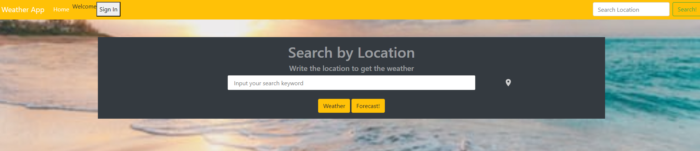
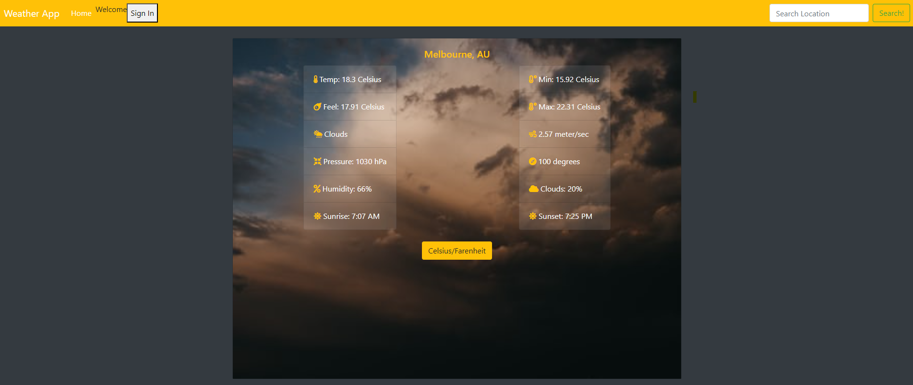
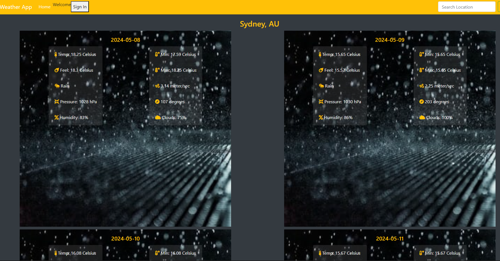

# Weather-App-JS

>  A weather app that pulls from the OpenWeatherMap API to allow users to search for and view the forecast in cities worldwide. 
> Built with JavaScript.

Landing Page:

Actual Weather:

5-Day Forecast:

Additional description about the project and its features.

## Built With

- HTML 
- CSS
- JAVASCRIPT
- NPM
- WEBPACK
- BOOTSTRAP
- GITHUB ACTIONS

